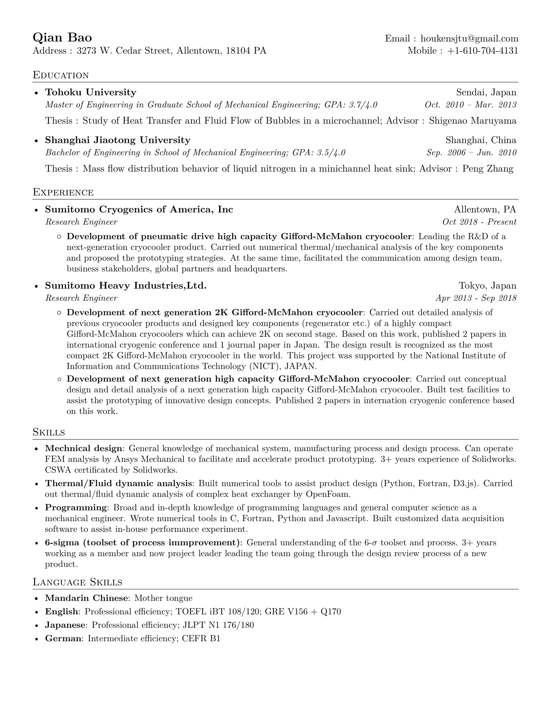
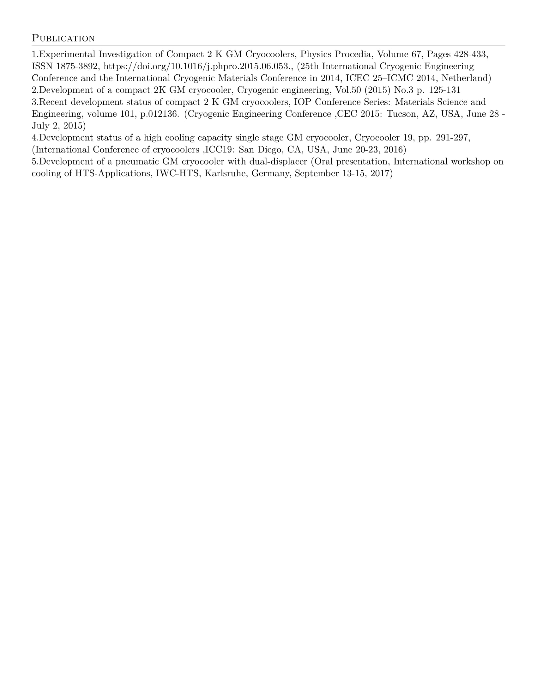

# My personal Curricula Vitae / Resume

This repoistory contains all the source files (including Fonts) needed to compile my CV.
The original purpose of creating this repo is to make it possible for me to revise my CV
from anywhere (usually would be my home and my office).

## Build
The source is supposed to be compiled by xelatex (not latex) since the usage of font depends
on functionality of xelatex.
You can compile the source by:

xelatex *.tex

## Preview

